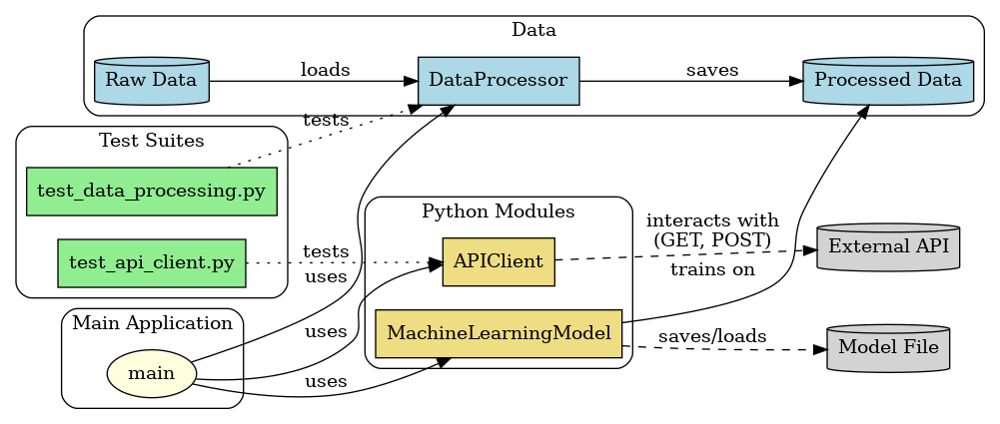

# StrathosNet Architecture

## Overview
The architecture of StrathosNet is designed to provide a scalable, efficient, and secure satellite communication network. This document outlines the key components and their interactions within the system.

## Components
- **Core Framework:** The main application that manages network operations and user interactions.
- **Satellite Manager:** Responsible for managing satellite connections and data routing.
- **User  Manager:** Handles user profiles, authentication, and access control.
- **AI Algorithms:** Implements machine learning models for optimizing network performance.
- **Security Framework:** Ensures secure communication through encryption and authentication.

## System Diagram

## Data Flow
1. User requests are processed by the User Manager.
2. The Satellite Manager routes data to the appropriate satellite.
3. AI algorithms analyze traffic and optimize bandwidth allocation.
4. Security measures are applied to ensure data integrity and confidentiality.

## Conclusion
The architecture of StrathosNet is modular and designed for extensibility, allowing for future enhancements and integrations.
